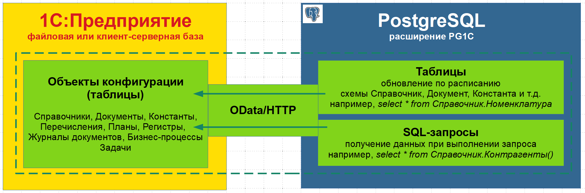
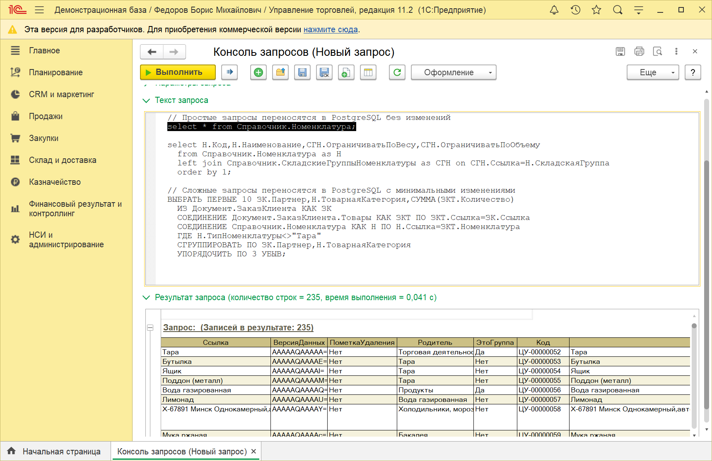
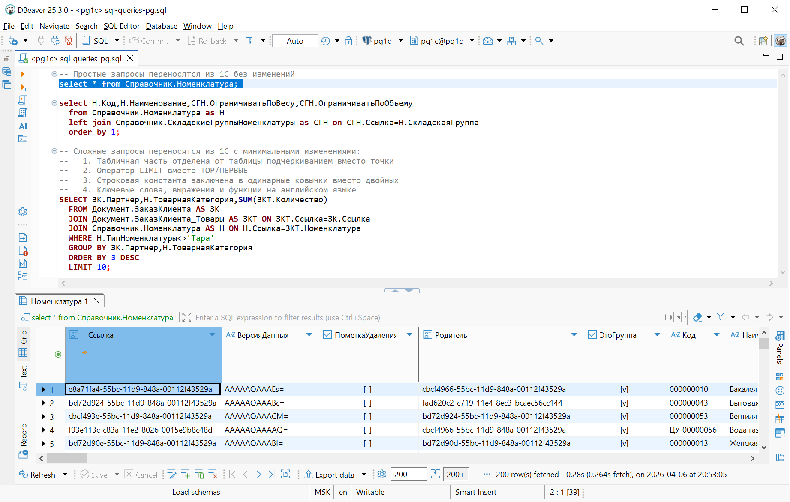

## PG1C | Данные 1С в PostgreSQL

PG1C - это расширение PostgreSQL, которое "встраивает" информационную базу 1С (файловую или клиент-серверную) в PostgreSQL, создавая и обновляя таблицы максимально идентичные таблицам 1С (объектам конфигурации). Данные 1С интегрированы в PostgreSQL "как есть": простые SQL-запросы копируются из платформы 1С (например, из Консоли запросов) в PostgreSQL без изменений, сложные — с минимальными изменениями.

Данные в таблицах обновляются либо по расписанию, либо непосредственно в SQL-запросе.
Поддерживаются 4 режима обновления данных: полное и быстрое отдельной процедурой (например, в фоновом режиме по расписанию), полное и по первичному ключу в SQL-запросе (например, в важных отчетах). Обновление метаданных выполняется без пересоздания таблицы, данных — без перезаписи строк таблицы, это позволяет настраивать права доступа к таблице, создавать индексы, внешние ключи и представления.

Скачать бинарные сборки и ознакомиться с особенностями установки для каждого типа операционной системы (Microsoft Windows, Debian/Ubuntu, RHEL-based)
можно на странице [Загрузка](https://pg1c.org/ru/download/)

<b>Схема взаимодействия</b>



<b>SQL-запросы в консоли запросов 1С</b>



<b>SQL-запросы в PostgreSQL, перенесены с минимальными изменениями</b>



### Простой пример ###

```sql
-- Устанавливаем расширение 
create extension pg1c;

-- Настраиваем доступ к серверу 1С
update pg1c.server_1c 
  set web_address='192.168.1.10',publication='УТ',user_1c='odata',password_1c='[пароль]';

-- Получаем URL к метаданным и проверяем его в браузере
select pg1c.http_url();

-- Создаем таблицу
select pg1c.create_table('Справочник.Контрагенты');

-- Выбираем данные из таблицы
select * from Справочник.Контрагенты;

-- Выбираем данные из табличной части 2 способами
select * from Справочник.Контрагенты_КонтактнаяИнформация;
select КонтактнаяИнформация from Справочник.Контрагенты;

-- Обновляем и выбираем данные
select * from Справочник.Контрагенты();
```


### Основные процедуры и функции ###
  
*   **pg1c.create\_table([таблица\_1С])** - создание в PostgreSQL таблицы аналогичной таблице 1С
*   **\[Таблица\_1С\]()** - полностью обновить таблицу и вернуть ее
*   **pg1c.refresh\_data\_all()** - обновить данные всех созданных таблиц

Все процедуры и служебные таблицы описаны в документации [documentation/documentation.html](https://htmlpreview.github.io/?https://github.com/PG1C/PG1C/blob/main/documentation/documentation.html) 

### Ключевые особенности ### 

*   **Идентичность таблиц** - Названия, порядок и тип данных полей максимально соответствуют между собой в 1С и PostgreSQL
*   **Универсальность обновления данных** - обновление данных возможно по расписанию в двух режимах - полное и быстрое, в SQL-запросе - полное и по первичному ключу
*   **"Мягкое" обновление данных** - выполняется только update измененных строк, это позволяет избежать блокировок по первичному ключу
*   **Обновление метаданных** - обновление метаданных (структуры) выполняется без пересоздания таблицы, это позволяет настраивать доступ, создавать индексы
*   **Длинные наименования** - наименования усекаются до 63 байт (ограничение PostgreSQL), в SQL-запросах можно использовать полное имя таблицы - ошибки не будет. Альтернативно можно настроить автоматическое сокращение имен
*   **Составной тип данных 1С** - поддерживается составной тип данных 1С, для него в PostgreSQL создан тип <a href="https://pg1c.org/ru/documentation/#value_any" target="_blank">pg1c.value_any</a>
*   **Загрузка данных частями** - большие объемы данных загружаются частями во временную таблицу и только после полной загрузки выполняется обновление данных в одной транзакции
*   **Соблюдение лицензионного соглашения** - использование штатного доступа по протоколу OData не нарушает лицензии 1С в отличие от прямого обращения к данным информационной базы \([ответ 1С на вопрос 65 по лицензированию](https://v8.1c.ru/priobretenie-i-vnedrenie/otvety-na-tipovye-voprosy-po-litsenzirovaniyu-1s-predpriyatiya-8/#65)\)


### Устройство и принцип работы ###

Платформа 1С:Предприятие поддерживает "из коробки" доступ к данным по открытому протоколу [OData](https://en.wikipedia.org/wiki/Open_Data_Protocol) - [автоматически формируемый REST интерфейс](https://v8.1c.ru/platforma/rest-interfeys/).
Установка и настройка состоит из 3 этапов: публикация информационной базы в конфигураторе, установка расширения и настройка доступов.
Данный функционал доступен во всех конфигурациях, включая бесплатную учебную версию.
Протокол OData позволяет получать не только данные, но и их описание (метаданные) — список доступных таблиц, табличные части, столбцы с типами данных, первичные и внешние ключи.
В отличие от прямого доступа к данным 1С, работа по протоколу OData не нарушает лицензионного соглашения.
Использование клиентской лицензии на подключение оптимизировано.

Расширение PG1C обращается к платформе 1С через WEB-сервер по протоколу OData, на основе метаданных создает в PostgreSQL таблицы и хранимые процедуры для обновления данных.
Созданные хранимые процедуры вызываются по расписанию или непосредственно в SQL-запросе. Поддерживается работа с несколькими серверами 1С в одной бд PostgreSQL:
для каждого сервера можно настроить отдельные схемы (например, через префикс) или для каждой таблицы 1С явно указать схему и наименование в PostgreSQL.
PostgreSQL имеет ограничение 63 байта на длину имен таблиц и столбцов. Длинные имена либо усекаются, либо сокращаются (настраивается).
При усечении в SQL-запросе можно использовать и длинное имя (как в 1С). 

Более подробно на сайте [pg1c.org](https://pg1c.org/ru/) 


### Поддержка ### 

При возникновении затруднений при установке готов помочь с инструментом, публикацией информационной базы 1С и настройкой PostgreSQL.  
Конечно, можете создать [issue](https://github.com/PG1C/PG1C/issues), отвечу на все запросы.  
Буду рад обсудить проект — обратная связь очень важна.

WhatsApp: [PGSuite (+7-936-1397626)](https://wa.me/79361397626)  
E-Mail: [support\@pgsuite.org](mailto:support@pgsuite.org?subject=PG1C)

С уважением, [Руслан \[aka PGSuite\] Баймеев](https://pgsuite.org/ru/contacts/#about-me) 
